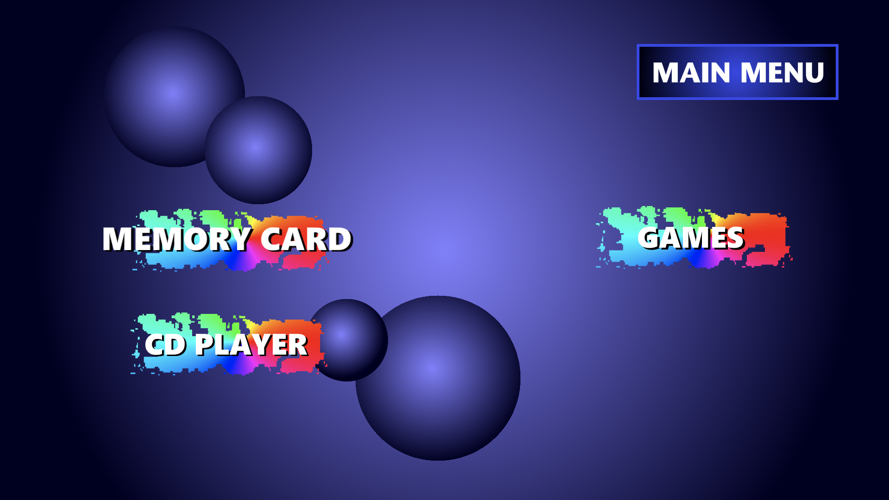
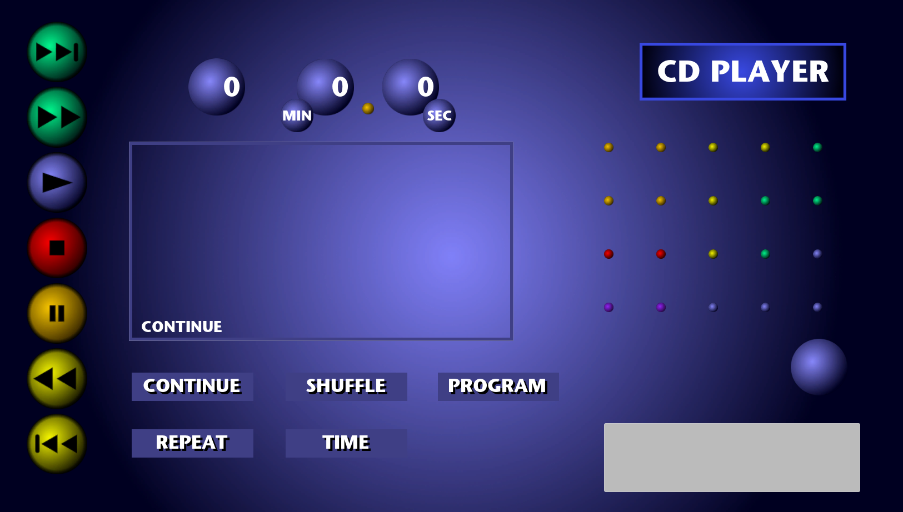

# PS1_Remake: Modern C++ Emulator Frontend & Toolkit


**PS1_Remake** is a custom, object-oriented C++ frontend built around the Libretro API, designed to provide a modern, highly decoupled interface for PlayStation 1 emulation, with Gemini to acelerate my development. 

Rather than just wrapping an emulator core, this project focuses on robust system architecture, low-level binary data manipulation, and building a bridge between virtual emulation and real-world physical hardware.

> **Note:** This project serves as a technical showcase of C++ software engineering, memory management, and reverse engineering.




## Engineering Highlights & Key Features

## 🤖 AI-Assisted Development 🤖
Building a custom C++ emulator frontend from scratch is a massive undertaking. Between wrestling with the Libretro API's complex documentation, managing low-level C++ memory, and balancing my limited time as a **solo developer**, I decided to bring in an AI co-pilot. 
I use **Google's Gemini Pro** as a sounding board to brainstorm low-level implementations, prototype boilerplate code, and speed up my workflow. However, the engineering vision is **entirely mine**. All the critical architectural decisions, the frontend/backend decoupling, the hardware integration logic, and the final debugging are human-driven.

### Advanced Memory Card Management (`MMC_Handle`)
A fully independent backend module engineered to read, write, and manipulate raw `.mcr` (Memory Card) binary files with absolute precision.
* **Binary Parsing & Checksums:** Accurately formats 128KB memory cards, calculates Sony's proprietary XOR checksums, and manages 8KB block chaining (e.g., handling multi-block saves like *Gran Turismo 2*).
* **4-bit CLUT Rendering:** Extracts raw save icons by decoding Little-Endian 16-bit color palettes (RGB555) and parsing 4-bit nibbles into a 256-color pixel array, fully supporting Sony's STP (Transparency) bit.
* **Shift-JIS Decoding:** Reads Japanese characters directly from the raw binary and converts them to UTF-8 for modern UI rendering.
* **JSON Serialization:** Parses the raw hexadecimal data and exports it into a highly readable, custom `.smrc` (Special Format Memory Card) JSON structure for seamless frontend integration using `nlohmann/json`.

### Custom UI Framework (Powered by SDL3)
Built strictly with **SDL3**, bypassing heavy commercial engines to maintain complete control over the render pipeline.
* Object-Oriented UI components (`BtnClass`).
* Hardware-accelerated texture scaling and pixel-perfect rendering (Nearest Neighbor) to preserve original 16x16 pixel art integrity.
* Decoupled architecture separating the UI/Menu state from the Emulator Core state.

### Physical Hardware Bridge (Upcoming)
The architecture is currently being prepared to interface via Serial USB with an **Arduino (MemCARDuino)**. This will allow the C++ backend to read and write save data directly to physical, plastic PS1 Memory Cards using SPI (Serial Peripheral Interface) communication protocols.

## Technology Stack
* **Language:** C++20
* **Graphics & Input:** SDL3, SDL3_image, SDL3_ttf
* **Build System:** CMake
* **Data Serialization:** nlohmann/json
* **Emulation Core:** Libretro API (Mednafen/Beetle PSX)

## Architecture Overview
The project strictly follows a decoupled design pattern:
1. **Core / Backend:** Handles Libretro callbacks, binary file parsing, and memory management.
2. **View / Frontend:** Handles SDL3 rendering, input polling, and UI states.
3. **App Controller:** The `PS1_Remake` master class that orchestrates states and lifecycle management to prevent memory leaks.

## How to Build
*(Instructions for compiling the project using CMake on Windows/Linux)*

```bash
# Clone the repository
git clone [https://github.com/estape/PS1_Remake.git](https://github.com/estape/PS1_Remake.git)

# Create a build directory
mkdir build && cd build

# Generate CMake files and compile
cmake ..
cmake --build .
